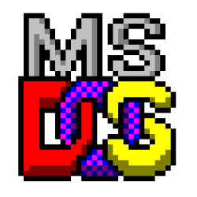

# MS-DOS 4.0 *modified*

[](https://github.com/ZacWalk/dos4z/actions/workflows/build.yml)

<p align="center">
  
</p>

This is a fork of Dos 4.00 source code as release by Microsoft. It has been modified to build on a modern Windows 11 machine using a original DOS build tools. DOS build tools require a shim I created called demu. I actively use this version of DOS on my Retro PC's and I am slowly adding features I require. Ver returns version 4.0z so you can identify it.

make-dos.ps1 creates 2 boot disk images in the output folder. They can be used to boot the built version of DOS.

## Building

Pre-built `demu.exe` and `dimg.exe` are checked into `output/`. Most contributors only need:

```powershell
.\make-dos.ps1              # Build everything
.\make-dos.ps1 -Clean       # Clean rebuild
.\make-dos.ps1 -Component bios   # Build one component
```

This uses demu to run the original DOS toolchain (NMAKE, MASM, LINK, CL, etc.) to compile the OS. Output goes to `output/`.

To rebuild the native tools after modifying sources in `tools/`:

```powershell
.\make-tools.ps1            # Rebuild demu.exe and dimg.exe (requires MSVC)
```

## Repository Layout

| Directory | Contents |
|-----------|----------|
| `dos/` | MS-DOS 4.0 source tree (renamed from original `src/`) |
| `dos/BOOT/` | Boot sector |
| `dos/BIOS/` | IO.SYS — hardware abstraction layer |
| `dos/DOS/` | MSDOS.SYS — kernel (INT 21h API, FAT, memory, processes) |
| `dos/CMD/` | External commands (COMMAND.COM, FORMAT, DEBUG, FDISK, etc.) |
| `dos/DEV/` | Device drivers (ANSI.SYS, RAMDRIVE.SYS, etc.) |
| `dos/SELECT/` | Interactive installer |
| `dos/MEMM/` | EMM386 expanded memory manager (386 protected mode) |
| `dos/MAPPER/` | OS/2-to-DOS API mapping library |
| `dos/INC/`, `dos/H/` | Shared includes and headers |
| `dos/TOOLS/` | Original 16-bit build tools (MASM, CL, LINK, NMAKE, etc.) |
| `tools/demu/` | DOS emulator — runs the 16-bit tools on modern Windows |
| `tools/dimg/` | Disk image creator |
| `output/` | Pre-built tool binaries (demu.exe, dimg.exe) and build artifacts |

## License

[MIT](LICENSE) — Copyright IBM and Microsoft Corporation.
